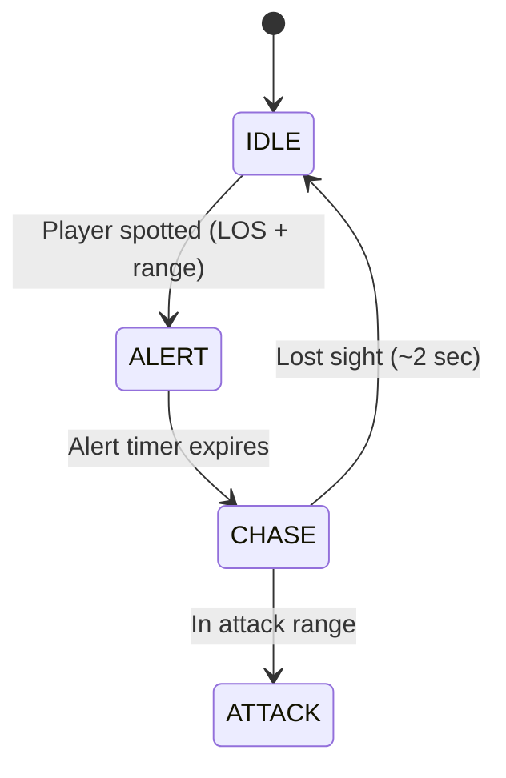

# Enemy System (`src/assets/sprites.js` + `src/game/state.js`)

This document describes the enemy types, behaviors, and AI system.

## Enemy Types

The game features 4 distinct enemy variants with unique appearances and stats:

| Type | Name | Appearance | Difficulty |
|:---:|:---|:---|:---|
| 0 | **Guard** | Blue suit, red tie | Easy |
| 1 | **Manager** | Gray suit, glasses | Medium |
| 2 | **Executive** | Black suit, hat, mustache | Hard |
| boss | **Head Designer** | Red/black suit, gold tie, crown | BOSS |

### Visual Features
Each enemy type has configurable visual elements:
- Suit color and shoulders
- Shirt and tie color
- Optional glasses
- Optional mustache
- Optional hat

## Enemy AI States

Enemies use a state machine with 4 states:



### State Details

| State | Behavior |
|:---|:---|
| **IDLE** | Small random patrol movements every ~1 second |
| **ALERT** | Brief pause when spotting player (visual cue) |
| **CHASE** | Move toward player with wall collision |
| **ATTACK** | Fire projectile at player with cooldown |

## Enemy Stats by Type

| Stat | Guard (0) | Manager (1) | Executive (2) | Boss |
|:---|:---:|:---:|:---:|:---:|
| Detect Range | 8 | 10 | 12 | 20 |
| Attack Range | 5 | 6 | 8 | 15 |
| Move Speed | 0.02 | 0.03 | 0.04 | 0.025 |
| Attack Cooldown | 3.5s | 2.5s | 2.0s | 1.5s |
| Health | 25 | 35 | 50 | 500 |

## Sprite States

Each enemy type has 3 sprite states:
- `enemy_idle_X` - Standing, alert
- `enemy_pain_X` - Hit, tilted head, red flash
- `enemy_dead_X` - Lying down with paint splatter

## Adding New Enemy Types

1. Add a new `createEnemy` call in `sprites.js` with config:
```javascript
createEnemy('_3', {
    suitColor: '#color',
    shirtColor: '#color',
    tieColor: '#color',
    hasGlasses: true/false,
    hasMustache: true/false,
    hatColor: '#color' or null
});
```

2. Add stats in `getEnemyStats()` in `state.js`:
```javascript
3: { detectRange: X, attackRange: X, moveSpeed: X, attackCooldown: X, health: X }
```

3. Update enemy variant range in `loadLevel()` if needed.
